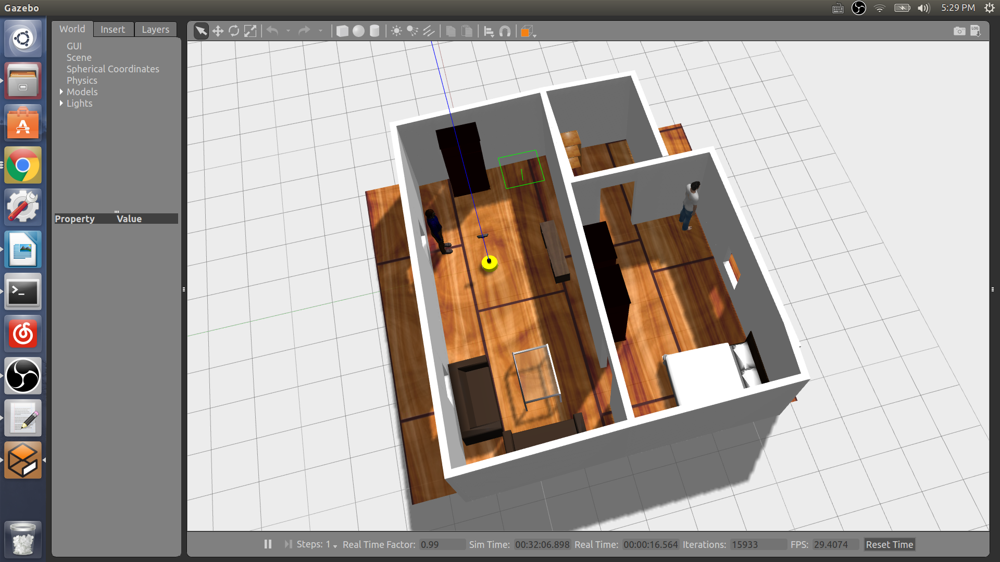
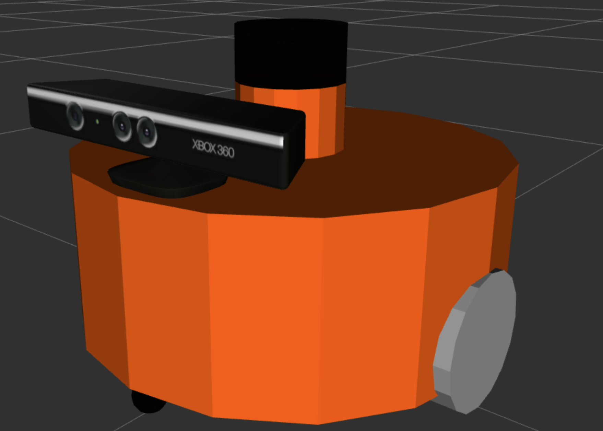

# Homebot

Homebot is a domestic service robots developed by ROS. This robot has two main function:
1. map whole new environment automatically; 
2. recognize main functional furnitures and home appliances (eg. tables, refrigerators) and record their positions in the map in the meantime. 

These two functions is very important for a robot getting into a new environment and "understanding" how this environment looks like and where are those functional objects (for future interaction, such as fetching a Coke from the refrigerator)

__**Click**__ below image you can see the result video.

[](https://www.youtube.com/watch?v=lAih0WwKcEY)

## Install Related Package

```
  sudo apt-get install ros-kinetic-gmapping

  sudo apt-get install ros-kinetic-navigation

  sudo apt-get install ros-kinetic-point_cloud
```

Also need to install [YOLO for ros](https://github.com/leggedrobotics/darknet_ros) and [Mask RCNN for ros](https://github.com/qixuxiang/mask_rcnn_ros)

## Demo
All tasks are tested in a customized apartment in GAZEBO. The apartment looks like below:



Also, the robot is defined by ourself and looks like below:



__**Click**__ below image you can see the robot explor and map the apartment automatically.

[](https://www.youtube.com/watch?v=DRGliFoOi40)

__**Click**__ below image you can see how whole pipeline work.

[](https://www.youtube.com/watch?v=XHkAjr_L9BU)


## Usage

##### gmapping demo:
```
roslaunch mbot_gazebo view_mbot_with_laser_kinect.launch

roslaunch mbot_navigation gmapping_demo.launch  

roslaunch mbot_teleop mbot_teleop.launch 
```

After finished the mapping establish, use this line to save the map data:

```
rosrun map_server map_saver -f cloister_gmapping  # a package in the navigation stack
```
##### Navigation demo:
```
roslaunch mbot_gazebo view_mbot_with_laser_kinect.launch

roslaunch mbot_navigation nav_cloister_demo.launch
```
##### SLAM + Navigation: 
```
roslaunch mbot_gazebo view_mbot_with_laser_kinect.launch

roslaunch mbot_navigation exploring_slam_demo.launch
```
##### SLAM + Navigation Automatically:
```
roslaunch mbot_gazebo view_mbot_with_laser_kinect.launch

roslaunch mbot_navigation exploring_slam_demo.launch

rosrun  mbot_navigation exploring_slam.py
```
##### Mask-rcnn
```
roslaunch mbot_gazebo view_mbot_with_laser_kinect.launch

roslaunch mask_rcnn_ros mask_demo.launch
```


